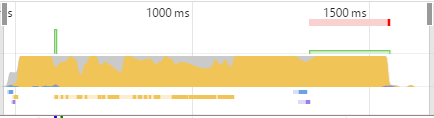
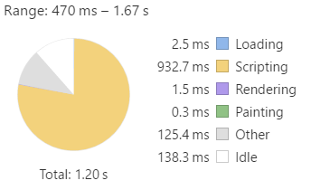
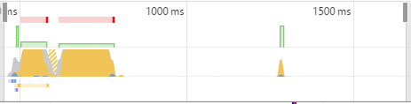
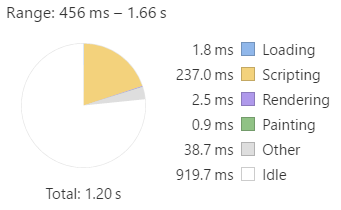

**WIP - This guide covers Angular Universal. 
In so doing, it also describes how to perform _Ahead of Time_ (AOT) compilation using Webpack.**

## Overview

In the [AOT Compiler cookbook](..cookbook/aot-compiler.html) you compiled an Angular app ahead of time using `ngc`,
then bundle them with `rollup`.
In this guide, bundles a different way, using the AOT: a [Webpack]() plugin.

Webpack has some advantages over the `ngc` + `rollup` approach shown earlier.

 - The webpack plugin can compile [Angular Universal]() apps, a capability not in `ngc` as of this writing
 - The webpack plugin can create separate bundles for lazy-loaded modules
 - The webpack plugin creates bundles with better [source maps](http://blog.teamtreehouse.com/introduction-source-maps) than Rollup
 - The webpack plugin is faster than `ngc` + `rollup`
 - Webpack has more loader and plug-in options than Rollup

There are also some disadvantages:

 - Less efficient bundling compared to Rollup due to an extra function scope and `require()` call for each bundled module
 - Less effective [tree-shaking](..cookbook/aot-compiler.html#tree-shaking) compared to Rollup.
 
Webpack tree-shakes at the module level, and will include an entire module if any part of it is imported.
Rollup tree-shakes at the statement level, and will include only the parts of a module that are imported.

### The Motivation

The [AOT Compiler cookbook explains](..cookbook/aot-compiler.html#aot-jit) the advantages of AOT over JIT.  One of the advantages is start-up time: the time it takes from the first HTTP request until the fully-functional Angular app.
You can measure this by using the Timeline feature in [Chrome DevTools](https://developers.google.com/web/tools/chrome-devtools/evaluate-performance/timeline-tool).

Timeline offers many ways to inspect the JavaScript performance of your app. 
This guide shows just some simple charts.
The images below show a 1.2-second snapshot, beginning with the request of the Dashboard page from the Tour of Heroes app.

<table>
  <tr>
    <th></th>
    <th>Timeline</th>
    <th>Time Allocation</th>
  </tr>
  <tr>
    <td>JIT</td>
    <td></td>
    <td></td>
  </tr>
  <tr>
    <td>AOT</td>
    <td></td>
    <td></td>
  </tr>
</table>

The JIT version took about 3 times longer to complete startup. 
That's huge in a tiny app like Tour of Heroes.  
Most of the time difference was in JavaScript, which reflects the effort needed to compile the application in the JIT version. 

### The Example

This guide uses the Tour of Heroes app as an example.  The app files remain the same, but some additional files and folders will be added to the directory structure to support the AOT configuration.  The folder structure will look like this:

```shell
aot/ index.html                index file for AOT version
      style.css                 styles for AOT version
      dist/ build.js            AOT-compiled application bundle
src/ index.html                index file for JIT version
      main.ts                   bootstrapper for JIT version
      main-aot.ts               bootstrapper for AOT version
      style.css                 styles for JIT version
      app/ app.module.ts        application code
          (etc.)
bs-config.json                 config file for lite server, JIT version
bs-config.aot.json             config file for lite server, AOT version
package.json                   npm configuration
systemjs.config.js             SystemJS configuration for JIT version
tsconfig.json                  TypeScript configuration for JIT version
tsconfig-aot.json              TypeScript configuration for AOT version
webpack.config.aot.js          Webpack configuration for AOT version
```

This guide covers the new files in the sections below

## Preparation

### Installing the tools

To get started, you need to install the necessary modules for AOT and Webpack.

 - `@angular/compiler-cli` - The ngc compiler that compiles Angular applications 
 - `@angular/platform-server` - Server-side components needed for compilation
 - `webpack` - The JavaScript bundler
 - `@ngtools/webpack` - The Webpack loader and plugin for bundling compiled applications

You can install them all at once with the following command:

```
npm install @angular/compiler-cli @angular/platform-server webpack @ngtools/webpack --save-dev
```

## Configuration

### Creating the tsconfig-aot.json

The AOT compiler, `ngc`, compiles TypeScript (like `tsc`) and compiles your app's components, services, etc. into executable code. 
You configure it using a JSON file similar to `tsconfig.json`.  There are a few differences:

 - The `module` setting must be `es2015`.
 This creates JavaScript output with `import` statements (instead of `require()`) that can be compiled and bundled.
 - The `files` setting includes the app module and the main AOT bootstrapper.  See more about this in the section below.
 - There is a new `angularCompilerOptions` section with the following settings:
     - `genDir` - the output directory that will contain the compiled code
   - `entryModule` - the root module of the app, expressed as **path/to/file#ClassName**.
     - `skipMetadataEmit` - set to `true` because you don't need metadata in the bundled application

Create a `tsconfig-aot.json` file by copying your `tsconfig.json` and applying the changes described above.

```json
{
    "compilerOptions": {
        "target": "es5",
        "module": "es2015",
        "moduleResolution": "node",
        "sourceMap": true,
        "emitDecoratorMetadata": true,
        "experimentalDecorators": true,
        "lib": ["es2015", "dom"],
        "noImplicitAny": true,
        "suppressImplicitAnyIndexErrors": true,
        "typeRoots": [ "node_modules/@types/" ]
    },

    "files": [
        "src/app/app.module.ts",
        "src/main-aot.ts"
    ],

    "angularCompilerOptions": {
        "genDir": "aot",
        "entryModule": "./src/app/app.module#AppModule",
        "skipMetadataEmit" : true
    }
}
```

### Main Entry Point

In the JIT-compiled app, `main.ts` is the entry point that bootstraps the app module.  
An AOT-compiled app bootstraps differently, using `platformBrowser` instead of `platformBrowserDynamic` and using the *factory* that is created by pre-compiling the app module.  

Create a `main-aot.ts` like the one shown here:

```ts
import { platformBrowser }    from '@angular/platform-browser';
import { AppModuleNgFactory } from '../aot/src/app/app.module.ngfactory';

platformBrowser().bootstrapModuleFactory(AppModuleNgFactory);
```

There's a chicken-and-egg problem.
The `AppModuleNgFactory` won't exist until the app is compiled, but the `main-aot.ts` won't compile because `AppModuleNgFactory` doesn't exist yet.

One way around this problem is to compile `app.module.ts` before `main-aot.ts`.  Tell the compiler to do that using the `files` array in the `tsconfig-aot.json` as shown above.

```json
"files": [
    "src/app/app.module.ts",
    "src/main-aot.ts"
],
```

### Component-relative Template URLs

The AOT compiler requires that `@Component` URLS for external templates and css files be *component-relative*.
That means that the value of @Component.templateUrl is a URL value relative to the component class file.
For example, an `'./app.component.html'` URL means that the template file is a sibling of its companion app.component.ts file.
(The leading `./` is needed by Webpack to recognize that the string represents a path and not a module name.)

Before you convert all absolute URLs to relative, there is one caveat:  
SystemJS requires the `moduleId` in order to resolve relative URLs, so if you want to enable both AOT and browser-side compilation,
you will need to add the `moduleId: module.id` to each of your components.

From this:

```ts
    @Component({
        selector: 'my-component',
        templateUrl: 'app/demo/components/my.component.html'
    })
```
To this:
```ts
    @Component({
        selector: 'my-component',
        moduleId: module.id,
        templateUrl: './my.component.html'
    })
```

## Webpack Configuration

The [Webpack Introduction](webpack.html) explains how to configure Webpack to bundle your Angular application.
Using Webpack for AOT is similar, but uses different [loaders](webpack.html#loaders) and [plugins](webpack.html#plugins).  

Create a `webpack.config.aot.js` file like this.  The salient parts are described below.

    const ngtools = require('@ngtools/webpack');

    module.exports = {
        devtool: 'source-map',
        entry: {
            main: './src/main-aot.ts'
        },
        resolve: {
            extensions: ['.ts', '.js']
        },
        target: 'node',
        output: {
            path: 'aot/dist',
            filename: 'build.js'
        },
        plugins: [
            new ngtools.AotPlugin({
                tsConfigPath: './tsconfig-aot.json'
            })
        ],
        module: {
            rules: [
                { test: /\.css$/, loader: 'raw-loader' },
                { test: /\.html$/, loader: 'raw-loader' },
                { test: /\.ts$/, loader: '@ngtools/webpack' }
            ]
        }
    }


### Loader
For AOT, the **loader** to use for TypeScript files is `@ngtools/webpack`.
This loads TypeScript files and interprets the Angular decorators to prepare for AOT compilation.
Since it is used for TypeScript files, configure the loader for `*.ts`:

    module: {
        rules: [
            ...
            { test: /\.ts$/, loader: '@ngtools/webpack' } // use ngtools loader for typescript
        ]
    }

When CSS and HTML files are encountered while processing the TypeScript, the [raw-loader](https://webpack.js.org/loaders/raw-loader/) is used.
It simply loads the file as a string, allowing Webpack to include it in the bundle.

For more complex loading scenarios, see the [Webpack Introduction](https://angular.io/docs/ts/latest/guide/webpack.html#loaders).

### Plugin

The AOT **plugin** is called `ngtools.AotPlugin`, and performs TypeScript compilation and Angular compilation
using the same underlying compiler as `ngc`.
The plugin accepts [several options](https://www.npmjs.com/package/@ngtools/webpack#options), but the only required option is `tsConfigPath`. 

> Despite the [ngtools documentation](https://www.npmjs.com/package/@ngtools/webpack#options), the `entryModule` option must be in the `tsconfig-aot.json`.

    plugins: [
        new ngtools.AotPlugin({
            tsConfigPath: './tsconfig-aot.json'
        })
    ],


The `tsConfigPath` tells the plugin where to find the TypeScript configuration file to use when compiling.
This should be the AOT-specific `tsconfig-aot.json` described above.

### Input

Webpack's inputs are the source files for your application.
You just need to give it the [entry point(s)](webpack.html#entries-outputs), and
Webpack follows the dependency graph to find what files it needs to bundle.

When performing AOT, the entry point is the `main-aot.ts` file described above.
Starting there, Webpack will pull in your app code and imported dependencies.
It will pull in the Angular libraries used by the app, but it will *not* pull in the Angular compiler, since it's not needed in an AOT-compiled app.

  entry: {
    main: './src/main-aot.ts'
  },

The [Webpack Introduction](webpack.html#entries-outputs) describes how to create separate bundles for 
app code, vendor libraries, and polyfills.  For simplicity, this example shows a single-bundle scenario.

### Output

After the plugin compiles the app files, Webpack bundles them into one or more output bundles.
These are the JavaScript files that will be loaded by the browser to run the app.  Tell Webpack where to put the bundles:

  output: {
    path: 'dist',
    filename: 'build.js'
  },

## Lite Server Configuration

The [lite-server](https://github.com/johnpapa/lite-server) is used in the [Quickstart](../quickstart.html) and
Tour of Heroes examples to run and test the application in development.
To use it for the AOT app-compiled app, create a new configuration file, `bs-config.aot.json`.
It's changed from the JIT version because it serves from the `aot` directory.
You also give it a new port number so you can run the versions side-by-side.  Here's the file:

    {
        "open": true,
        "port": 3100,
        "server": {
            "baseDir": "aot",
            "routes": {
                "/node_modules": "node_modules"
            }
        }
    }


## Build and Serve

Now that you've created the TypeScript and Webpack config files, you can build and run the application.  

### Add the Commands

Add the build and serve commands to the `scripts` section of your `package.json`.
This makes the commands easy to type, and npm sets the path to ensure that you are running the version
of the command from the project's own `node_modules` folder.  If you ever forget your commands, just type `npm run` to get a list.

    "scripts": {
        "build:aot": "webpack --config webpack.config.aot.js"
        "serve:aot": "lite-server -c bs-config.aot.json",    
        ...
    }

### Build the Bundle

After adding the commands above, type
```
npm run build:aot
```
to build the output bundle.
As configured above, this compiles the TypeScript files, Angular-compiles the components, and 
Webpacks the results into a single output file, `aot/dist/build.js`.
It also generates a [source map](https://webpack.js.org/configuration/devtool/), `aot/dist/build.js.map` that 
relates the bundle code to the source code.  

Source maps let you use the browser's [dev tools](https://developers.google.com/web/tools/chrome-devtools/javascript/source-maps) to set breakpoints in your source code, even though the browser is actually running an AOT-compiled bundle.

Examining the source map is a useful exercise because it shows the names of the files that are included in the bundle, 
in the order that Webpack included them.
If you create [multiple bundles](webpack.html#multiple-bundles), 
you can make sure the same file isn't included in more than one bundle.

Look at the `aot/dist/build.js.map`:

```
{"version":3,"sources":[
"webpack:///webpack/bootstrap 097108a2a4bbafeb64bb",
"webpack:///./~/rxjs/Observable.js",
"webpack:///./~/rxjs/Subscriber.js",
"webpack:///./~/@angular/core/@angular/core.es5.js",
"webpack:///./~/@angular/common/@angular/common.es5.js",
"webpack:///./~/@angular/router/@angular/router.es5.js",
"webpack:///./~/rxjs/util/root.js",
"webpack:///./~/@angular/http/@angular/http.es5.js",
"webpack:///./src/app/hero.service.ts",
...
```

This shows that Webpack has included `rxjs` and `@angular` libraries ahead of the app's own `hero.service.ts`.

### Run the Server

Finally you can run the AOT-compiled application.  Use the command
```
npm run serve:aot
```
to start the server.  It should also launch the browser and open the app.
