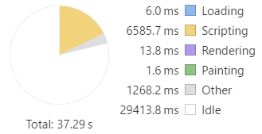
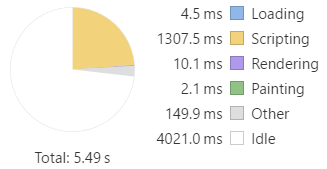

**WIP - This guide covers Angular Universal. 
In so doing, it also describes how to perform _Ahead of Time_ (AOT) compilation using Webpack.**

## Table of Malcontents

Overview
    What is Universal
        run app & render html on the server
    Why it matters
        discussion of slow devices
        graphs of performance
    The Example
        discussion
        directory structure
Preparation
    Installing packages
    Component-relative Template URLs
TypeScript Configuration
    tsconfig-aot.json
    Main entry point for aot
    tsconfig-uni.json
    Main entry point for universal
Webpack Configuration
    Loader
    Plugin
    Input
    Output
Server Configuration
    Lite Server
    Node Server
Building
    Add the Commands
    Build the AOT bundle
    Build the Universal bundle
Run the Server
    Examine the behavior


# Overview

Angular Universal is a technology that lets Angular applications run outside of the browser.  Using Universal, you can run your Angular application on any [nodejs]() server.  You can use it to generate the HTML output on-demand, or generate HTML files ahead of time.

Angular Universal works using _NgFactory_ classes created through [AOT Compilation](../cookbook/aot-compiler.html).  It's different from regular AOT because the app is compiled using `platform-server` instead of `platform-browser`.  This changes the app behavior to make it capable of rendering on the server.  For example, `platform-server` does not handle browser events, and it renders components to an HTML string instead of the browser DOM.

## Why Do It

Why would you want to create a static version of your app?  There are two main reasons:

1. SEO / No-JavaScript
1. Startup performance

### SEO / No-JavaScript

Your highly-interactive Angular app may not be easily digestible to search engines.  Using Angular Universal, you can generate a static version of your app with navigation through the pages.  This makes the content of your app searchable, linkable, and navigable without JavaScript.

### Startup Performance

> Everything counts in large amounts _- Depeche Mode_

Application startup time is critical for user engagement.  While AOT compilation speeds up application start times, it may not be enough, especially on mobile devices with slow connections.  [53% of mobile site visits are abandoned](https://www.doubleclickbygoogle.com/articles/mobile-speed-matters/) if pages take longer than 3 seconds to load.  Your app needs to load quickly, to engage users before they decide to do something else.

With Angular Universal, you can generate landing pages for the app that look like the complete app.  The pages are pure HTML, and can display even if JavaScript is disabled.  The pages do not handle browser events, but they _do_ support navigation through the site use [routerLink](../guide/router.html#!#router-link).

The recommended scenario is to serve a static version of the landing page, then load your Angular app behind it.  This gives the appearance of near-instant performance, and offers the full interactive experience once the full app is loaded.  Better than a "loading" spinner, it's a real screen that engages the user.

#### Startup Comparison

> The graph / on the wall (the graph) / tells the story / of it all _- Depeche Mode_

To illustrate the impact of Universal, we have used the [Timeline feature in Chrome DevTools](https://developers.google.com/web/tools/chrome-devtools/evaluate-performance/timeline-tool). Timeline offers many ways to inspect the performance of your app.  Here we have used it to compare the uncached startup performance of the _Tour of Heroes_ app.  Tour of Heroes is a simple demo app without much code or content, so it is probably smaller than the real apps you will build.  

The test was done by measuring the time from browser refresh until the Tour of Heroes Dashboard is fully displayed.  The numbers and bars below represent the time from the initial request until the Dashboard page is visible in the app, so lower numbers are better.

First, a PC browser with a local server, where browser performance and network response are very fast:
<style scoped>
    table.perf {
        width: 100%;
    }
    table.perf td {
        font-weight: bold;
        text-align: center;
    }
</style>
<table class="perf">
  <tr>
    <th></th>
    <th>Load Time</th>
    <th>Time Allocation</th>
  </tr>
  <tr>
    <td>JIT</td>
    <td>1.01s</td>
    <td></td>
  </tr>
  <tr>
    <td>AOT</td>
    <td>0.29s</td>
    <td></td>
  </tr>
  <tr>
    <td>Universal</td>
    <td>0.04s</td>
    <td></td>
  </tr>
</table>

You can see that the AOT-compiled version loaded faster than the JIT version (288ms versus 1000ms), and that most of the difference was in JavaScript execution.  The universal version was the fastest (40ms), with no JavaScript to execute. 

The difference may not seem significant, since all are sufficiently fast.  But how would the app perform on a slower device with a slower network connection?  [CPU Throttling](https://developers.google.com/web/updates/2016/09/devtools-digest#cpu_throttling_for_a_mobile-first_world) and [Network Throttling](https://developers.google.com/web/tools/chrome-devtools/network-performance/reference#throttling)  can help you find out.

The test was repeated using a simulated 5x slower CPU and simulated 3G network (750kb/s).

<table class="perf">
  <tr>
    <th></th>
    <th>Load Time</th>
    <th>Time Allocation</th>
  </tr>
  <tr>
    <td>JIT</td>
    <td>37.3s</td>
    <td></td>
  </tr>
  <tr>
    <td>AOT</td>
    <td>5.5s</td>
    <td></td>
  </tr>
  <tr>
    <td>Universal</td>
    <td>0.4s</td>
    <td></td>
  </tr>
</table>

In this mobile scenario, the JIT app spends almost 30 seconds just waiting for its many files to load, followed by 6.5 seconds executing JavaScript.  The AOT-compiled app is much better, spending just 4 seconds to load the bundle and 1.3 seconds to execute it, but still much more than the 3-second limit.

The Universal app displays the Dashboard page in just 0.4 seconds, since it displays without waiting for the JavaScript to load.  The app would not be fully functional until its JavaScript bundles have loaded, which would be comparable to the load time for the AOT app, but the user can view the first page immediately.

> If you want your app to be usable on slow networks, AOT or bundling is a must.  Universal should be considered if first impressions are important.

## The Example


This guide uses the Tour of Heroes app as an example.  The app files remain the same, but some additional files and folders will be added to the directory structure to support the AOT configuration.  The folder structure will look like this:

```shell
src/  index.html                    index file for JIT version
      index-aot.html                index file for AOT version
      main.ts                       bootstrapper for JIT version
      main-aot.ts                   bootstrapper for AOT version
      style.css                     styles for JIT version
      systemjs.config.js            SystemJS configuration for JIT version
      systemjs-angular-loader.js    component loader that allows relative paths
      tsconfig.json                 TypeScript configuration for JIT version
      app/  app.module.ts           application code
           (etc.)
      uni/  app.server.ts           server-side application module
            server-aot.ts           express web server
            universal-engine.ts     server-side app renderer
      dist/ build.js                AOT-compiled application bundle
      dist/ server.js               AOT-compiled server bundle
bs-config.json                      config file for lite server, JIT version
bs-config.aot.js                    config file for lite server, AOT version
package.json                        npm configuration
tsconfig-aot.json                   TypeScript configuration for AOT version
webpack.config.aot.js               Webpack configuration for AOT version
webpack.config.uni.js               Webpack configuration for AOT version
```

This guide covers the new files in the sections below

## Preparation

### Installing the tools

To get started, you need to install the necessary modules for AOT and Webpack.

 - `@angular/compiler-cli` - The ngc compiler that compiles Angular applications 
 - `@angular/platform-server` - Server-side components needed for compilation
 - `webpack` - The JavaScript bundler
 - `@ngtools/webpack` - The Webpack loader and plugin for bundling compiled applications

You can install them all at once with the following command:

```
npm install @angular/compiler-cli @angular/platform-server webpack @ngtools/webpack --save-dev
```

## Configuration

### Creating the tsconfig-aot.json

The AOT compiler, `ngc`, compiles TypeScript (like `tsc`) and compiles your app's components, services, etc. into executable code. 
You configure it using a JSON file similar to `tsconfig.json`.  There are a few differences:

 - The `module` setting must be `es2015`.
 This creates JavaScript output with `import` statements (instead of `require()`) that can be compiled and bundled.
 - The `files` setting includes the app module and the main AOT bootstrapper.  See more about this in the section below.
 - There is a new `angularCompilerOptions` section with the following settings:
     - `genDir` - the output directory that will contain the compiled code.  When compiling via Webpack, no files are written here.
   - `entryModule` - the root module of the app, expressed as **path/to/file#ClassName**.
     - `skipMetadataEmit` - set to `true` because you don't need metadata in the bundled application

Create a `tsconfig-aot.json` file by copying your `tsconfig.json` and applying the changes described above.

```json
{
    "compilerOptions": {
        "target": "es5",
        "module": "es2015",
        "moduleResolution": "node",
        "sourceMap": true,
        "emitDecoratorMetadata": true,
        "experimentalDecorators": true,
        "lib": ["es2015", "dom"],
        "noImplicitAny": true,
        "suppressImplicitAnyIndexErrors": true,
        "typeRoots": [ "node_modules/@types/" ]
    },

    "files": [
        "src/app/app.module.ts",
        "src/main-aot.ts"
    ],

    "angularCompilerOptions": {
        "genDir": "aot",
        "entryModule": "./src/app/app.module#AppModule",
        "skipMetadataEmit" : true
    }
}
```

### Main Entry Point

In the JIT-compiled app, `main.ts` is the entry point that bootstraps the app module.  
An AOT-compiled app bootstraps differently, using `platformBrowser` instead of `platformBrowserDynamic` and using the *factory* that is created by pre-compiling the app module.  

Create a `main-aot.ts` like the one shown here:

```ts
import { platformBrowser }    from '@angular/platform-browser';
import { AppModuleNgFactory } from '../aot/src/app/app.module.ngfactory';

platformBrowser().bootstrapModuleFactory(AppModuleNgFactory);
```

There's a chicken-and-egg problem.
The `AppModuleNgFactory` won't exist until the app is compiled, but the `main-aot.ts` won't compile because `AppModuleNgFactory` doesn't exist yet.

One way around this problem is to compile `app.module.ts` before `main-aot.ts`.  Tell the compiler to do that using the `files` array in the `tsconfig-aot.json` as shown above.

```json
"files": [
    "src/app/app.module.ts",
    "src/main-aot.ts"
],
```

### Component-relative Template URLs

The AOT compiler requires that `@Component` URLS for external templates and css files be *component-relative*.
That means that the value of @Component.templateUrl is a URL value relative to the component class file.
For example, an `'./app.component.html'` URL means that the template file is a sibling of its companion app.component.ts file.
(The leading `./` is needed by Webpack to recognize that the string represents a path and not a module name.)

Before you convert all absolute URLs to relative, there is one caveat:  
SystemJS requires the `moduleId` in order to resolve relative URLs, so if you want to enable both AOT and browser-side compilation,
you will need to add the `moduleId: module.id` to each of your components.

From this:

```ts
    @Component({
        selector: 'my-component',
        templateUrl: 'app/demo/components/my.component.html'
    })
```
To this:
```ts
    @Component({
        selector: 'my-component',
        moduleId: module.id,
        templateUrl: './my.component.html'
    })
```

## Webpack Configuration

The [Webpack Introduction](webpack.html) explains how to configure Webpack to bundle your Angular application.
Using Webpack for AOT is similar, but uses different [loaders](webpack.html#loaders) and [plugins](webpack.html#plugins).  

Create a `webpack.config.aot.js` file like this.  The salient parts are described below.

    const ngtools = require('@ngtools/webpack');

    module.exports = {
        devtool: 'source-map',
        entry: {
            main: './src/main-aot.ts'
        },
        resolve: {
            extensions: ['.ts', '.js']
        },
        target: 'node',
        output: {
            path: 'aot/dist',
            filename: 'build.js'
        },
        plugins: [
            new ngtools.AotPlugin({
                tsConfigPath: './tsconfig-aot.json'
            })
        ],
        module: {
            rules: [
                { test: /\.css$/, loader: 'raw-loader' },
                { test: /\.html$/, loader: 'raw-loader' },
                { test: /\.ts$/, loader: '@ngtools/webpack' }
            ]
        }
    }


### Loader
For AOT, the **loader** to use for TypeScript files is `@ngtools/webpack`.
This loads TypeScript files and interprets the Angular decorators to prepare for AOT compilation.
Since it is used for TypeScript files, configure the loader for `*.ts`:

    module: {
        rules: [
            ...
            { test: /\.ts$/, loader: '@ngtools/webpack' } // use ngtools loader for typescript
        ]
    }

When CSS and HTML files are encountered while processing the TypeScript, the [raw-loader](https://webpack.js.org/loaders/raw-loader/) is used.
It simply loads the file as a string, allowing Webpack to include it in the bundle.

For more complex loading scenarios, see the [Webpack Introduction](https://angular.io/docs/ts/latest/guide/webpack.html#loaders).

### Plugin

The AOT **plugin** is called `ngtools.AotPlugin`, and performs TypeScript compilation and Angular compilation
using the same underlying compiler as `ngc`.
The plugin accepts [several options](https://www.npmjs.com/package/@ngtools/webpack#options), but the only required option is `tsConfigPath`. 

> Despite the [ngtools documentation](https://www.npmjs.com/package/@ngtools/webpack#options), the `entryModule` option must be in the `tsconfig-aot.json`.

    plugins: [
        new ngtools.AotPlugin({
            tsConfigPath: './tsconfig-aot.json'
        })
    ],


The `tsConfigPath` tells the plugin where to find the TypeScript configuration file to use when compiling.
This should be the AOT-specific `tsconfig-aot.json` described above.

### Input

Webpack's inputs are the source files for your application.
You just need to give it the [entry point(s)](webpack.html#entries-outputs), and
Webpack follows the dependency graph to find what files it needs to bundle.

When performing AOT, the entry point is the `main-aot.ts` file described above.
Starting there, Webpack will pull in your app code and imported dependencies.
It will pull in the Angular libraries used by the app, but it will *not* pull in the Angular compiler, since it's not needed in an AOT-compiled app.

  entry: {
    main: './src/main-aot.ts'
  },

The [Webpack Introduction](webpack.html#entries-outputs) describes how to create separate bundles for 
app code, vendor libraries, and polyfills.  For simplicity, this example shows a single-bundle scenario.

### Output

After the plugin compiles the app files, Webpack bundles them into one or more output bundles.
These are the JavaScript files that will be loaded by the browser to run the app.  Tell Webpack where to put the bundles:

  output: {
    path: 'dist',
    filename: 'build.js'
  },

## Lite Server Configuration

The [lite-server](https://github.com/johnpapa/lite-server) is used in the [Quickstart](../quickstart.html) and
Tour of Heroes examples to run and test the application in development.
To use it for the AOT app-compiled app, create a new configuration file, `bs-config.aot.json`.
It's changed from the JIT version because it serves from the `aot` directory.
You also give it a new port number so you can run the versions side-by-side.  Here's the file:

    {
        "open": true,
        "port": 3100,
        "server": {
            "baseDir": "aot",
            "routes": {
                "/node_modules": "node_modules"
            }
        }
    }


## Build and Serve

Now that you've created the TypeScript and Webpack config files, you can build and run the application.  

### Add the Commands

Add the build and serve commands to the `scripts` section of your `package.json`.
This makes the commands easy to type, and npm sets the path to ensure that you are running the version
of the command from the project's own `node_modules` folder.  If you ever forget your commands, just type `npm run` to get a list.

    "scripts": {
        "build:aot": "webpack --config webpack.config.aot.js"
        "serve:aot": "lite-server -c bs-config.aot.json",    
        ...
    }

### Build the Bundle

After adding the commands above, type
```
npm run build:aot
```
to build the output bundle.
As configured above, this compiles the TypeScript files, Angular-compiles the components, and 
Webpacks the results into a single output file, `aot/dist/build.js`.
It also generates a [source map](https://webpack.js.org/configuration/devtool/), `aot/dist/build.js.map` that 
relates the bundle code to the source code.  

Source maps let you use the browser's [dev tools](https://developers.google.com/web/tools/chrome-devtools/javascript/source-maps) to set breakpoints in your source code, even though the browser is actually running an AOT-compiled bundle.

Examining the source map is a useful exercise because it shows the names of the files that are included in the bundle, 
in the order that Webpack included them.
If you create [multiple bundles](webpack.html#multiple-bundles), 
you can make sure the same file isn't included in more than one bundle.

Look at the `aot/dist/build.js.map`:

```
{"version":3,"sources":[
"webpack:///webpack/bootstrap 097108a2a4bbafeb64bb",
"webpack:///./~/rxjs/Observable.js",
"webpack:///./~/rxjs/Subscriber.js",
"webpack:///./~/@angular/core/@angular/core.es5.js",
"webpack:///./~/@angular/common/@angular/common.es5.js",
"webpack:///./~/@angular/router/@angular/router.es5.js",
"webpack:///./~/rxjs/util/root.js",
"webpack:///./~/@angular/http/@angular/http.es5.js",
"webpack:///./src/app/hero.service.ts",
...
```

This shows that Webpack has included `rxjs` and `@angular` libraries ahead of the app's own `hero.service.ts`.

### Run the Server

Finally you can run the AOT-compiled application.  Use the command
```
npm run serve:aot
```
to start the server.  It should also launch the browser and open the app.
